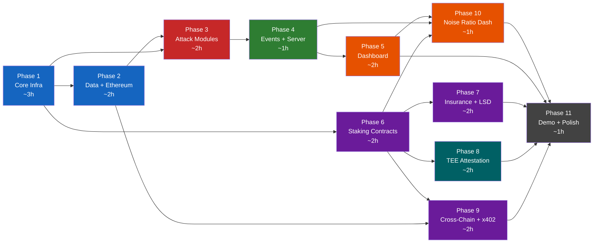

# Trusted ClawMon — Design Document

> A curated, attack-resistant, crypto-economically secured registry overlay for MCP skills, built on ERC-8004.
> Monad MessageLog contract + smart contracts + Monad ERC-8004 cross-chain reads + TEE attestation + x402 micropayments.

---

## 1. System Architecture

### 1.1 Mermaid Architecture Diagram

```mermaid
graph TB
    subgraph DataSources["DATA SOURCES"]
        MCPHub["MCP Hub<br/>3,002 real skills"]
        ERC8004Main["ERC-8004 Mainnet<br/>22,000+ registered<br/>~100 legit"]
    end

    subgraph MonadLayer["MONAD (Primary Chain)"]
        ML_ID["MessageLog Identity Topic"]
        ML_FB["MessageLog Feedback Topic"]
        ML_ATT["MessageLog Attestation Topic"]
        ChainContracts["Smart Contracts<br/>(Solidity on Monad EVM)"]
    end

    subgraph CrossChainLayer["MONAD + MAINNET (Read-Only)"]
        Monad_ID["Monad IdentityRegistry<br/>0x8004A818...BD9e"]
        Monad_REP["Monad ReputationRegistry<br/>0x8004B663...8713"]
        Main_ID["Mainnet IdentityRegistry<br/>0x8004A169...a432"]
        Main_REP["Mainnet ReputationRegistry<br/>0x8004BAa1...9b63"]
    end

    subgraph SmartContracts["SMART CONTRACTS"]
        TrustStaking["TrustStaking.sol<br/>Publisher + Curator staking<br/>Dynamic min stake<br/>7-day unbonding"]
        SlashManager["SlashManager.sol<br/>Proposals, arbiters<br/>Auto + manual slash<br/>Fund distribution"]
        ReviewBonding["ReviewBonding.sol<br/>1 MON bond per review<br/>Bond recovery/slashing"]
        Treasury["ProtocolTreasury.sol<br/>Fee routing<br/>x402 revenue splits<br/>Arbiter compensation"]
        Insurance["InsurancePool.sol<br/>30% of slash funds<br/>Automated victim payout<br/>Max 50% pool per claim"]
        LiquidStake["LiquidStaking.sol<br/>tcMON minting<br/>1:1 exchange rate<br/>Slash-adjusted pricing"]
        TEEVerifier["TEEAttestationVerifier.sol<br/>Code hash pinning<br/>DCAP verification<br/>24h freshness window"]
        StakeBridge["StakeBridge.sol<br/>Cross-chain recognition<br/>50% foreign credit<br/>Effective stake calc"]
    end

    subgraph TEELayer["TEE ATTESTATION (Tier 3)"]
        TEETypes["TEEAttestation Types<br/>CodeHash, Platform, Report"]
        TEEVerify["Verifier Logic<br/>SGX/TDX/SEV attestation"]
        MLAttest["MessageLog Attestation Records<br/>Signed code hashes"]
    end

    subgraph ScoringEngine["SCORING ENGINE"]
        Naive["Naive Engine<br/>(attack target)<br/>Simple average<br/>No decay, no weighting"]
        Hardened["Hardened Engine<br/>(mitigations ON)<br/>Graph analysis<br/>Temporal decay<br/>Submitter weighting<br/>Velocity monitor"]
        StakeWeighted["Stake-Weighted Rep<br/>Higher-staked reviewers<br/>get more scoring weight<br/>Cap at 5x multiplier"]
        OpenAuth["Open Auth Filter<br/>feedbackAuth must be 'open'<br/>or skill is excluded"]
        TierAssess["Unified Tier Assessment<br/>Tier 0: Listed<br/>Tier 1: Reputation<br/>Tier 2: Economic<br/>Tier 3: Hard Trust"]
    end

    subgraph PaymentLayer["PAYMENT LAYER (x402)"]
        X402["x402 Micropayments<br/>Per-use skill payments"]
        FeeSplit["Fee Split<br/>80% publisher<br/>10% protocol<br/>10% curators"]
    end

    subgraph AttackModules["ATTACK MODULES"]
        Sybil["1. Sybil Farming<br/>Fake skills colluding<br/>Mutual positive feedback"]
        Launder["2. Reputation Launder<br/>Trusted skill goes rogue<br/>Score persistence window"]
        Poison["3. Attestation Poison<br/>Mass negative reviews<br/>Cost asymmetry proof"]
        Arbitrage["4. Trust Arbitrage<br/>Cross-chain fragmentation<br/>LIVE Monad reads"]
    end

    subgraph DashboardAPI["DASHBOARD + API"]
        Express["Express Server :3001<br/>REST endpoints<br/>WebSocket broadcast"]
        React["React Dashboard<br/>Evidence board theme<br/>2x2 attack grid"]
        NoiseRatio["Noise Ratio Panel<br/>22,667 → filtered<br/>Live tier counters"]
        SybilViz["SybilViz — D3 force graph"]
        LaunderViz["LaunderViz — SVG area chart"]
        PoisonViz["PoisonViz — Bar chart"]
        ArbitrageViz["ArbitrageViz — 3-chain cards"]
        StakingPanel["Staking Economics Panel<br/>Cost comparison toggles"]
    end

    %% Data flow: Seed
    MCPHub -->|"Parse skills +<br/>seed to MessageLog"| ML_ID
    MCPHub -->|"Generate synthetic<br/>feedback"| ML_FB

    %% Ethereum reads
    Arbitrage -->|"LIVE contract reads<br/>getSummary()"| Monad_REP
    Arbitrage -->|"LIVE contract reads<br/>ownerOf()"| Main_REP
    Arbitrage -->|"agentExists()"| Monad_ID
    Arbitrage -->|"agentExists()"| Main_ID

    %% MessageLog to Scoring
    ML_FB -->|"Read feedback<br/>via RPC reads"| Naive
    ML_FB -->|"Read feedback<br/>via RPC reads"| Hardened
    ML_ID -->|"Check feedbackAuth<br/>policy"| OpenAuth
    ML_ATT -->|"Attestation<br/>records"| TEEVerify

    %% TEE flow
    TEETypes --> TEEVerify
    TEEVerify --> TEEVerifier
    TEEVerifier -->|"Tier 3<br/>status"| TierAssess
    TEEVerify --> MLAttest

    %% Contracts to Scoring
    TrustStaking -->|"Stake state<br/>reads"| StakeWeighted
    TrustStaking -->|"Compliance<br/>checks"| TierAssess
    ReviewBonding -->|"Reviewer stakes<br/>for weighting"| StakeWeighted
    StakeBridge -->|"Effective stake<br/>inc. foreign"| TierAssess
    Insurance -->|"Pool balance<br/>for API"| Express

    %% Scoring pipeline
    OpenAuth --> Naive
    OpenAuth --> Hardened
    Naive --> TierAssess
    Hardened --> TierAssess
    StakeWeighted --> TierAssess

    %% Contract interactions
    SlashManager -->|"Slash execution"| TrustStaking
    SlashManager -->|"Slash review bonds"| ReviewBonding
    SlashManager -->|"30% to insurance"| Insurance
    SlashManager -->|"20% to treasury"| Treasury
    Treasury -->|"Fund insurance"| Insurance
    LiquidStake -->|"Mint/redeem<br/>tcMON"| TrustStaking
    TEEVerifier -->|"Code hash<br/>mismatch → slash"| SlashManager

    %% Payment flow
    X402 -->|"Per-use payments"| FeeSplit
    FeeSplit -->|"10% protocol"| Treasury
    Treasury -->|"60% to staking<br/>yield pool"| TrustStaking
    Treasury -->|"30% to insurance"| Insurance

    %% Attack to Scoring
    Sybil -->|"Adversarial<br/>feedback"| ML_FB
    Launder -->|"Phase 1: build trust<br/>Phase 2: go rogue"| ML_FB
    Poison -->|"Mass negative<br/>reviews"| ML_FB

    %% Scoring to Dashboard
    TierAssess -->|"Trust results"| Express
    Express -->|"WebSocket<br/>events"| React
    React --> NoiseRatio
    React --> SybilViz
    React --> LaunderViz
    React --> PoisonViz
    React --> ArbitrageViz
    React --> StakingPanel

    %% Cross-chain bridge
    ERC8004Main -->|"Observed<br/>registrations"| NoiseRatio
    StakeBridge -->|"Foreign stake<br/>proofs"| Monad_REP

    %% Styling
    classDef monad fill:#6F2DA8,stroke:#fff,color:#fff
    classDef ethereum fill:#627EEA,stroke:#fff,color:#fff
    classDef attack fill:#CC0000,stroke:#fff,color:#fff
    classDef scoring fill:#2E7D32,stroke:#fff,color:#fff
    classDef dashboard fill:#E65100,stroke:#fff,color:#fff
    classDef contract fill:#4A148C,stroke:#fff,color:#fff
    classDef tee fill:#006064,stroke:#fff,color:#fff
    classDef payment fill:#F57F17,stroke:#333,color:#333

    class ML_ID,ML_FB,ML_ATT,ChainContracts monad
    class Monad_ID,Monad_REP,Main_ID,Main_REP ethereum
    class Sybil,Launder,Poison,Arbitrage attack
    class Naive,Hardened,StakeWeighted,OpenAuth,TierAssess scoring
    class Express,React,NoiseRatio,SybilViz,LaunderViz,PoisonViz,ArbitrageViz,StakingPanel dashboard
    class TrustStaking,SlashManager,ReviewBonding,Treasury,Insurance,LiquidStake,TEEVerifier,StakeBridge contract
    class TEETypes,TEEVerify,MLAttest tee
    class X402,FeeSplit payment
```



### 1.2 Data Flow Summary

```
1. SEED:    Parse real MCP Hub skill data → write to Monad MessageLog contract as ERC-8004 identity registrations
2. LIST:    Skills with feedbackAuth: 'open' are included in Trusted ClawMon registry
3. FEEDBACK: Community feedback written to MessageLog contract as ERC-8004 giveFeedback messages
4. SCORE:   Scoring engine reads MessageLog feedback via contract view calls → computes trust tiers (AAA–C)
5. STAKE:   Publishers stake MON → scoring engine reads stake state → unified Tier 0–3
6. ATTEST:  TEE attestation proves code hasn't changed → Tier 3 hard trust
7. PAY:     x402 micropayments per skill use → fee splits fund treasury + insurance
8. ATTACK:  Attack modules submit adversarial feedback → scoring engine shows vulnerability
9. MITIGATE: Hardened engine applies graph analysis, decay, weighting → shows defense
10. BRIDGE:  Cross-chain stake recognition → foreign stake credits → narrows arbitrage gap
11. INSURE:  Slash redistribution funds insurance → automated victim compensation
12. DISPLAY: Dashboard shows all of the above in real-time via WebSocket
```

### 1.3 Trust Tier Model

```
┌─────────────────────────────────────────────────┐
│  TIER 3: Hard Trust (TEE + Formal Verification) │
│  Cryptographic proof agent code hasn't changed   │
├─────────────────────────────────────────────────┤
│  TIER 2: Economic Trust (Staking + Slashing)    │
│  Collateralized, slashable, financially bonded   │
├─────────────────────────────────────────────────┤
│  TIER 1: Soft Trust (Reputation Scoring)        │
│  Community feedback, mitigated, stake-weighted   │
├─────────────────────────────────────────────────┤
│  TIER 0: Listed (Open Auth Required)            │
│  Registered + open feedback auth enabled         │
└─────────────────────────────────────────────────┘
```

Each tier builds on the one below. An agent must pass Tier 0 and maintain Tier 1 before staking into Tier 2. Tier 3 requires Tier 2 staking plus valid TEE attestation.

---

## 2. Tech Stack

| Layer | Technology | Role |
|---|---|---|
| **Blockchain (Primary)** | Monad Testnet — MessageLog contract + smart contracts | Consensus ordering, smart contracts |
| **Blockchain (Cross-Chain)** | Monad + Mainnet ERC-8004 (read-only) | Arbitrage proof, cross-chain reads |
| **Smart Contracts** | Solidity on Monad EVM | Staking, slashing, insurance, TEE, bridge |
| **Backend Runtime** | Node.js + TypeScript | Server, scoring engine, attack modules |
| **Backend Framework** | Express.js | REST API, WebSocket server |
| **Blockchain SDK** | `ethers.js` v6 | MessageLog interaction, contract calls, cross-chain reads (Monad/Mainnet) |
| **Frontend** | React + Vite + TypeScript | Dashboard SPA |
| **Visualizations** | D3.js (force graph), SVG (charts) | Attack visualization panels |
| **Real-Time** | WebSocket (native `ws`) | Live attack event broadcast |
| **CLI** | Commander.js | Attack command execution |
| **Styling** | CSS (evidence board theme) | Corkboard, manila, typewriter fonts |

---

## 3. Implementation Plan — 11 Phases

### Phase 1: Core Infrastructure (~3 hours)

**Key Deliverables:**
- Monad testnet client with operator account configuration
- MessageLog contract create/submit/read utilities
- Account creation helpers for test accounts
- Core TypeScript types: `Feedback`, `FeedbackSummary`, `TrustTier`, `AccessDecision`
- MessageLog feedback reader via contract view calls
- Naive scoring engine (simple average, no decay — the attack target)
- Hardened scoring engine with toggleable mitigations
- Graph analysis (mutual feedback detection) and velocity monitoring

**Dependencies:** None — this is the foundation.

**Must-Have vs. Nice-to-Have:**
- **Must:** MessageLog client, naive scorer, hardened scorer, types
- **Must:** Graph analysis + velocity mitigations
- **Cut if behind:** Account creation helpers (use hardcoded operator account)

**Files:**
1. `src/monad/client.ts`
2. `src/monad/message-log.ts`
3. `src/monad/accounts.ts`
4. `src/scoring/types.ts`
5. `src/scoring/reader.ts`
6. `src/scoring/engine.ts`
7. `src/scoring/hardened.ts`
8. `src/mitigations/graph.ts`
9. `src/mitigations/velocity.ts`

---

### Phase 2: Data + Ethereum (~2 hours)

**Key Deliverables:**
- ethers.js read-only providers for Monad + Mainnet
- ERC-8004 contract read functions (`getSummary`, `agentExists`)
- Registry types (`ClawMonSkill`, `ListingRequirement`, `DelistReason`)
- Open auth filter + automatic delisting logic
- Seed script parsing real awesome-mcp-skills data into MessageLog contract
- Verified seeding: 20+ skills with feedback on MessageLog contract

**Dependencies:** Phase 1 (MessageLog client, types, scoring engine)

**Must-Have vs. Nice-to-Have:**
- **Must:** Ethereum client, ERC-8004 reads, seed script, open auth filter
- **Must:** At least 50 seeded skills for demo credibility
- **Cut if behind:** Full awesome-mcp-skills parsing — hardcode 50 skills instead (Section 17)
- **Cut if behind:** Mainnet reads — keep Monad only (Section 17)

**Files:**
10. `src/ethereum/client.ts`
11. `src/ethereum/erc8004.ts`
12. `src/registry/types.ts`
13. `src/registry/listing.ts`
14. `scripts/seed-clawmon-data.ts`

---

### Phase 3: Attack Modules (~2 hours)

**Key Deliverables:**
- Attack config and step result types
- Sybil farming attack (fake skills, mutual positive feedback, colluding publishers)
- Reputation laundering attack (trust-building phase, malicious pivot, score persistence window)
- Attestation poisoning attack (mass negative reviews from fake accounts, cost asymmetry)
- Cross-chain trust arbitrage (LIVE Monad + Mainnet reads via ethers.js, 3-system view)
- All attacks implemented as async generators yielding step events

**Dependencies:** Phase 1 (scoring), Phase 2 (Ethereum client, seeded data)

**Must-Have vs. Nice-to-Have:**
- **Must:** All 4 attack modules — they are the core demo
- **Must:** LIVE Monad contract reads in arbitrage (key differentiator)
- **Cut if behind:** Mainnet reads in arbitrage — show "No Data" for mainnet card

**Files:**
16. `src/attacks/types.ts`
17. `src/attacks/sybil.ts`
18. `src/attacks/launder.ts`
19. `src/attacks/poison.ts`
20. `src/attacks/arbitrage.ts`

---

### Phase 4: Events + Server (~1 hour)

**Key Deliverables:**
- Singleton EventEmitter for attack step events
- WebSocket broadcast server for real-time dashboard updates
- Express REST API: `POST /api/attacks/:type`, `GET /api/attacks/status`, `GET /api/noise-ratio`
- Commander.js CLI with commands for each attack type
- Single-command demo mode (`npm run demo`)

**Dependencies:** Phase 1–3 (scoring, attacks, data)

**Must-Have vs. Nice-to-Have:**
- **Must:** Express server, WS broadcast, attack endpoints
- **Must:** CLI for attack execution
- **Cut if behind:** CLI (use REST API directly from dashboard)

**Files:**
22. `src/events/emitter.ts`
23. `src/events/ws-server.ts`
24. `src/server.ts`
25. `src/cli/index.ts`

---

### Phase 5: Dashboard (~2 hours)

**Key Deliverables:**
- Vite + React scaffolding with evidence board theme (dark corkboard, manila panels, typewriter fonts)
- WebSocket hook for real-time attack events
- Attack trigger hook (POST to API)
- SybilViz: D3 force-directed graph showing collusion network
- LaunderViz: SVG area chart with trust threshold line, green→red transition
- PoisonViz: Bar chart with tier-colored bars, score collapse visualization
- ArbitrageViz: 3 case cards (Monad / Mainnet) with "LIVE" badges
- Panel titles with dual narrative subtitles (MCP Hub + ERC-8004 context)
- Header stats strip: "22,667 registered | ~100 legit | 99.5% noise"
- Mitigation toggle buttons per panel

**Dependencies:** Phase 4 (server, WS, API)

**Must-Have vs. Nice-to-Have:**
- **Must:** All 4 viz panels, WS integration, mitigation toggles
- **Must:** ArbitrageViz "LIVE" badges (proves real cross-chain reads)
- **Cut if behind:** Dashboard header rebrand, Griffith/Crapis quote overlays (Section 17)
- **Cut if behind:** D3 force graph complexity — fall back to simpler network viz

**Files:**
26–32. Dashboard scaffolding + all viz components + hooks

---

### Phase 6: Staking Contracts (~2 hours)

**Key Deliverables:**
- `TrustStaking.sol` — publisher staking, curator delegation, 7-day unbonding, dynamic minimum stake, compliance checks
- `SlashManager.sol` — slash proposals, evidence submission, automated execution (sybil/auth revocation), arbiter voting (3-of-5), fund distribution (40% reporters / 30% insurance / 20% treasury / 10% burned)
- `ReviewBonding.sol` — 1 MON bond per review, bond recovery after cooldown, bond slashing for fraudulent reviews
- `ProtocolTreasury.sol` — fee distribution routing, x402 revenue intake, arbiter compensation
- Stake-weighted reputation scoring in the off-chain engine
- Dynamic minimum stake calculator (`requiredStake >= 1.5x monthlyVolume`)
- Unified Tier 0–3 assessment integrating stake state with reputation
- Attack simulations with staking cost comparisons (e.g., "Sybil: 520,000x more expensive")

**Dependencies:** Phase 1 (scoring engine), Phase 3 (attacks for cost comparison)

**Must-Have vs. Nice-to-Have:**
- **Must:** TrustStaking, SlashManager, ReviewBonding, ProtocolTreasury contracts
- **Must:** Stake-weighted scoring, dynamic stake calculator
- **Cut if behind:** Arbiter committee dispute flow — use automated slashing only (Section 17)
- **Cut if behind:** Correlated slashing math — use flat percentages (Section 17)

**Files:**
33. `contracts/TrustStaking.sol`
34. `contracts/SlashManager.sol`
35. `contracts/ReviewBonding.sol`
36. `contracts/ProtocolTreasury.sol`
37. `src/scoring/stake-weighted.ts`
38. `src/staking/dynamic-stake.ts`

---

### Phase 7: Insurance + Liquid Staking (~2 hours)

**Key Deliverables:**
- `InsurancePool.sol` — claim submission, arbiter approval, automated payout, max 50% of pool per claim, pool balance tracking
- Off-chain insurance pool state management and claim types
- `LiquidStaking.sol` — tcMON minting (1:1 with staked MON), redemption (initiates 7-day unbonding), exchange rate tracking, slash-adjusted pricing
- Off-chain tcMON state management and exchange rate computation

**Dependencies:** Phase 6 (TrustStaking, SlashManager for slash fund routing)

**Must-Have vs. Nice-to-Have:**
- **Must:** InsurancePool.sol with claim logic
- **Must:** Insurance state tracking for dashboard
- **Cut if behind:** LiquidStaking.sol / tcMON entirely — defer to post-v1 (Section 17)

**Files:**
41. `contracts/InsurancePool.sol`
42. `src/staking/insurance.ts`
43. `contracts/LiquidStaking.sol`
44. `src/staking/liquid-staking.ts`

---

### Phase 8: TEE Attestation (~2 hours)

**Key Deliverables:**
- TEE types: `TEEAttestation`, `AttestationResult`, `CodeHashPin`
- `TEEAttestationVerifier.sol` — code hash pinning, attestation submission, DCAP verification, 24h freshness window, Tier 3 gating, auto-slash on code hash mismatch
- Off-chain attestation verification logic
- MessageLog attestation record publishing and reading
- Tier 3 integration in scoring engine's unified assessment

**Dependencies:** Phase 6 (TrustStaking for Tier 2 prerequisite, SlashManager for auto-slash)

**Must-Have vs. Nice-to-Have:**
- **Must:** TEE types, TEEAttestationVerifier contract, MessageLog records, Tier 3 in scoring
- **Cut if behind:** Full DCAP verification — accept signed attestation reports without full DCAP chain (Section 17)
- **Cut if behind:** SGX/TDX/SEV specifics — use a simulated attestation for v1

**Files:**
45. `src/tee/types.ts`
46. `contracts/TEEAttestationVerifier.sol`
47. `src/tee/verifier.ts`
48. `src/tee/message-log-attestation.ts`

---

### Phase 9: Cross-Chain Stake + x402 (~2 hours)

**Key Deliverables:**
- `StakeBridge.sol` — foreign stake recognition, 50% credit discount, effective stake computation (local + foreign), proof verification
- Off-chain cross-chain stake view aggregation and arbitrage gap calculation
- x402 payment types: `PaymentConfig`, `x402Receipt`
- x402 micropayment integration: per-use skill payments, fee splitting (80% publisher / 10% protocol / 10% curators), treasury-funded staking yield computation

**Dependencies:** Phase 6 (TrustStaking), Phase 2 (Ethereum client for cross-chain reads)

**Must-Have vs. Nice-to-Have:**
- **Must:** StakeBridge contract, cross-chain stake view
- **Must:** x402 types and payment processing logic
- **Cut if behind:** StakeBridge cross-chain proof verification — use mock proofs for v1 (Section 17)
- **Cut if behind:** Full x402 HTTP integration — simulate payment flow

**Files:**
50. `contracts/StakeBridge.sol`
51. `src/ethereum/stake-bridge.ts`
52. `src/payments/types.ts`
53. `src/payments/x402.ts`

---

### Phase 10: Noise Ratio Dashboard (~1 hour)

**Key Deliverables:**
- `GET /api/noise-ratio` endpoint aggregating registered/staked/trusted counts across all deployments
- `NoiseRatioViz.tsx` — 3-column funnel visualization:
  - Column 1: ERC-8004 raw (22,667 registered, 99.5% noise — red tint)
  - Column 2: Trusted ClawMon filtered (open auth → Tier 1 → Tier 2 → Tier 3 — green tint, animated counters)
  - Column 3: MCP Hub raw (5,700+ skills, 230+ malicious — context)
- WebSocket integration for real-time counter updates during attacks

**Dependencies:** Phase 4 (server, WS), Phase 5 (dashboard), Phase 6 (staking for tier counts)

**Must-Have vs. Nice-to-Have:**
- **Must:** Noise ratio endpoint + basic visualization
- **Must:** Real-time updates during attacks
- **Cut if behind:** Animated counter transitions — use static numbers

**Files:**
54. `GET /api/noise-ratio` (in `src/server.ts`)
55. `dashboard/src/components/viz/NoiseRatioViz.tsx`

---

### Phase 11: Demo + Polish (~1 hour)

**Key Deliverables:**
- Single-command demo mode: `npm run demo` — seeds data, runs all 4 attacks sequentially
- Dashboard staking economics panel or toggle (cost comparison: "0.02 MON vs 10,400 MON")
- README with:
  - MCP Hub problem statement
  - Setup instructions (Monad testnet account, monad-testnet RPC)
  - Architecture diagram
  - Bankless podcast citations (Crapis, Griffith quotes)
  - Attack ↔ real-world incident mapping
- Backup demo video recording
- Dashboard deployment to Vercel

**Dependencies:** All prior phases

**Must-Have vs. Nice-to-Have:**
- **Must:** Demo command, README, working end-to-end flow
- **Cut if behind:** Vercel deployment (run locally), staking economics panel, video

**Files:**
57–61. Demo scripts, README, deployment config

---

## 4. Phase Dependency Graph



**Critical path:** P1 → P2 → P3 → P4 → P5 → P11

**Parallelizable:** P6/P7/P8/P9 can be developed in parallel after P1, then integrated before P10/P11.

---

## 5. Risks and Mitigations (Solo Builder on Testnet)

### 5.1 Monad Testnet Reliability

| Risk | Likelihood | Impact | Mitigation |
|---|---|---|---|
| Monad testnet goes down during development/demo | Medium | High — blocks all MessageLog operations | **Primary:** Implement local fallback mode that caches MessageLog messages in-memory and replays when testnet returns. **Secondary:** Pre-record a backup demo video (Phase 11). **Tertiary:** The scoring engine and attack modules can operate on cached data without live MessageLog. |
| RPC read lag (messages take minutes to appear) | High | Medium — delays feedback reads | Use contract writes + local write-through cache. Don't depend on RPC for real-time demo flow; read from local state, verify against contract view calls async. |
| Monad testnet account rate limiting | Medium | Medium — slows seed script | Batch MessageLog submissions with delay (100ms between messages). Seed in advance, not during demo. Cache seeded topic IDs in `.env`. |
| Monad testnet contract deployment failures | Medium | High — blocks staking layer | Deploy contracts early (Phase 6). Keep contract ABIs + addresses in config. Have a "mock staking" fallback that simulates contract state in-memory if deployment fails. |

### 5.2 TEE Simplification for v1

| Risk | Likelihood | Impact | Mitigation |
|---|---|---|---|
| No access to real SGX/TDX/SEV hardware for attestation | High | Medium — can't produce real attestations | **v1 approach:** Simulate TEE attestation with signed code hashes. The `TEEAttestationVerifier.sol` contract is real and deployed, but attestation proofs are generated by a test harness rather than genuine TEE hardware. Document this as "TEE-ready" — the on-chain verification is production-grade, the attestation source is simulated. |
| DCAP verification too complex for solo implementation | High | Medium | Skip full DCAP chain verification. Accept any well-formed attestation report in v1 (Section 17 cut). The contract interface is correct; verification depth is the variable. |

### 5.3 Real-Time WebSocket Complexity

| Risk | Likelihood | Impact | Mitigation |
|---|---|---|---|
| WS connection drops during demo | Medium | High — dashboard goes dark | Implement auto-reconnect with exponential backoff in `useWebSocket.ts`. Queue events server-side; replay missed events on reconnect. Keep a "last known state" in React so the dashboard shows stale data rather than nothing. |
| WS message ordering issues | Low | Medium — viz shows jumbled attack steps | Use sequence numbers on all events. Dashboard buffers and sorts by sequence before rendering. Attack generators yield ordered steps. |
| Browser performance under rapid WS updates | Medium | Medium — dashboard freezes | Throttle dashboard renders to 10fps max. Batch WS messages into 100ms windows. Use `requestAnimationFrame` for D3 updates. |

### 5.4 Cross-Chain Read Reliability

| Risk | Likelihood | Impact | Mitigation |
|---|---|---|---|
| Monad RPC endpoint down or rate-limited | Medium | Medium — arbitrage panel shows "unavailable" | Use multiple fallback RPCs for monad-testnet. Cache last-known Monad reads. Show cached data with "CACHED" badge instead of "LIVE" if read fails. |
| ERC-8004 contracts upgraded or moved on Monad | Low | High — contract reads fail entirely | Pin contract addresses in config. Monitor contract existence at startup. Fall back to mocked cross-chain data if contracts are unreachable. |
| Mainnet RPC read failures (free tier limits) | High | Low — mainnet reads are nice-to-have | Mainnet reads are first-cut-candidate (Section 17). Default to Monad-only if mainnet is unreliable. Show "NO DATA" on mainnet card — this actually strengthens the arbitrage narrative. |

### 5.5 Smart Contract Complexity (8 Contracts)

| Risk | Likelihood | Impact | Mitigation |
|---|---|---|---|
| Contract interactions create unexpected bugs on Monad | Medium | High — staking layer broken | Test each contract in isolation first (Hardhat local), then deploy to Monad. Keep contracts minimal — no upgradability patterns, no proxy complexity. |
| Monad EVM gas/fee differences from standard EVM | Medium | Medium — deployment failures | Use Monad-specific Solidity compiler settings. Test `CREATE2` and `DELEGATECALL` behavior. Test against Monad EVM specifically. |
| 8 contracts is too many for a solo builder in a hackathon | High | High — can't complete all phases | **Prioritize:** TrustStaking + SlashManager + ReviewBonding are must-have. InsurancePool is must-have. ProtocolTreasury can be simplified. LiquidStaking and StakeBridge are first-cut (Section 17). TEEAttestationVerifier can be simplified. |

### 5.6 Scope Creep / Time Management

| Risk | Likelihood | Impact | Mitigation |
|---|---|---|---|
| Phases 6–9 consume all remaining time | High | High — no polish, no demo | **Hard cutoff:** If Phase 5 (dashboard) isn't complete by hour 10, skip to Phase 11 (demo/polish). A working demo of Phases 1–5 is more compelling than a half-finished Phase 6–9. The spec's Section 17 "Cut First" list is the playbook. |
| D3 force graph is harder than expected | Medium | Medium — sybil panel looks bad | Fall back to a simpler network visualization (CSS grid of connected nodes) rather than spending hours on D3 physics. |
| Seed script takes too long due to MessageLog rate limits | Medium | Medium — demo has thin data | Pre-seed during Phase 2. If MessageLog is too slow, hardcode 50 skills with pre-generated feedback directly (skip MessageLog write, read from local cache). |

### 5.7 Demo Environment

| Risk | Likelihood | Impact | Mitigation |
|---|---|---|---|
| Laptop or network fails during live demo | Low | Critical | Pre-record backup video (Phase 11). Have dashboard running on Vercel with pre-seeded data. Keep a local-only fallback mode that doesn't need any network. |
| Demo exceeds 3 minutes | Medium | Medium — gets cut off | Practice the demo script from Section 15 with a timer. Each attack gets ~30s. Cut arbitrage section short if running over — it's the least visually dramatic. |

---

## 6. Testing Approach Per Phase

### Phase 1: Core Infrastructure

| Test | Type | What It Validates |
|---|---|---|
| MessageLog topic creation on testnet | Integration | ethers.js correctly configured, operator account funded |
| MessageLog message submit + read round-trip | Integration | Messages written to topic appear via contract view calls |
| Naive scoring: 10 positive feedback → score in AAA/AA range | Unit | `computeSummary()` correctly averages and maps to tiers |
| Naive scoring: mixed feedback → expected tier | Unit | Tier thresholds are correct |
| Hardened scoring: mutual feedback pair → 90% discount | Unit | Graph analysis mitigation works |
| Hardened scoring: 15 feedback in 30s → velocity discount | Unit | Velocity monitoring triggers correctly |
| Mitigation toggles: each can be enabled/disabled independently | Unit | `MitigationConfig` flags respected |

**Approach:** Jest unit tests for scoring/mitigations. Manual integration test for MessageLog (run `scripts/setup-monad.ts`, verify topic ID returned).

---

### Phase 2: Data + Ethereum

| Test | Type | What It Validates |
|---|---|---|
| Monad `getSummary()` returns data for known agent ID | Integration | ethers.js provider + ABI + contract address correct |
| Monad `agentExists()` returns true/false correctly | Integration | Identity contract reads work |
| Mainnet reads return data or null gracefully | Integration | Error handling for missing agents |
| Seed script writes 20+ skills to MessageLog | Integration | Parsing + MessageLog submission pipeline works end-to-end |
| Open auth filter excludes skills with `feedbackAuth !== 'open'` | Unit | `filterByOpenAuth()` logic correct |
| Delisting triggers fire for auth revocation, low score, inactivity | Unit | `checkDelistingTriggers()` logic correct |

**Approach:** Jest unit tests for listing logic. Manual integration test: run seed script, verify skills appear in MessageLog via RPC reads. Run Monad reads against known contract addresses.

---

### Phase 3: Attack Modules

| Test | Type | What It Validates |
|---|---|---|
| Sybil: 20 fake skills reach "trusted" tier via naive scorer | Unit | Sybil attack successfully games naive engine |
| Sybil: same attack fails with graph analysis ON | Unit | Mitigation detects mutual feedback ring |
| Launder: score stays above threshold for N rounds after pivot | Unit | Laundering window is measurable |
| Launder: temporal decay drops score after pivot with mitigation ON | Unit | Decay mitigation shortens laundering window |
| Poison: 8 negative reviews drop legitimate skill below threshold | Unit | Poisoning succeeds against naive engine |
| Poison: submitter weighting mitigates the same attack | Unit | New-submitter discount prevents cheap poisoning |
| Arbitrage: async generator yields 3 system views | Unit | Step events have correct shape |
| Arbitrage: Monad read returns real data (or graceful null) | Integration | Cross-chain reads work in attack flow |

**Approach:** Jest unit tests mocking MessageLog reads. Integration test: run each attack against seeded testnet data, verify step events and final state.

---

### Phase 4: Events + Server

| Test | Type | What It Validates |
|---|---|---|
| EventEmitter publishes attack step events | Unit | Emitter singleton works, events have correct types |
| WS server broadcasts events to connected clients | Integration | WebSocket client receives events in order |
| `POST /api/attacks/sybil` triggers attack and returns status | Integration | Express routing + attack invocation works |
| `GET /api/attacks/status` returns current attack state | Integration | Status endpoint reflects running/completed state |
| `GET /api/noise-ratio` returns valid JSON shape | Integration | Noise ratio aggregation endpoint works |

**Approach:** Supertest for Express endpoints. Manual WS test: start server, connect with `wscat`, trigger attack, verify events stream.

---

### Phase 5: Dashboard

| Test | Type | What It Validates |
|---|---|---|
| Dashboard loads without errors | Smoke | Vite build succeeds, React renders |
| WS hook connects and receives events | Integration | `useWebSocket` auto-connects to server |
| "Run" button triggers attack via API | Integration | `useAttack` hook POSTs correctly |
| SybilViz renders D3 force graph with nodes + links | Visual | D3 integration works, nodes represent skills |
| LaunderViz shows area chart with threshold line | Visual | SVG rendering, score timeline correct |
| PoisonViz shows bar chart with tier colors | Visual | Bar heights reflect score values |
| ArbitrageViz shows 3 cards with "LIVE" badges | Visual | Cross-chain data renders, badges appear |
| Mitigation toggle changes visualization | Integration | Toggle state propagates to attack config |

**Approach:** Manual visual testing in browser. Verify each panel renders data from WS events. No automated UI tests (time constraint for solo builder).

---

### Phase 6: Staking Contracts

| Test | Type | What It Validates |
|---|---|---|
| `stakeSkill()` accepts MON, records stake, emits event | Unit (Hardhat) | TrustStaking basic flow |
| `stakeSkill()` rejects below-minimum stake | Unit (Hardhat) | Minimum stake enforcement |
| `delegateToSkill()` adds to total stake, updates tier | Unit (Hardhat) | Delegation mechanics |
| `proposeSlash()` + `executeAutoSlash()` distributes funds correctly | Unit (Hardhat) | SlashManager 40/30/20/10 split |
| `submitBondedReview()` requires 1 MON bond | Unit (Hardhat) | ReviewBonding minimum bond |
| `slashReviewBond()` transfers bond to slash pool | Unit (Hardhat) | Bond slashing works |
| Stake-weighted scoring: 50 MON reviewer outweighs 1 MON reviewer | Unit | Weight calculation correct |
| Dynamic stake: skill with 1000 MON monthly volume requires 1500 MON stake | Unit | `computeStakeRequirement()` correct |
| Monad deployment of all 4 contracts succeeds | Integration | Contracts compile and deploy on Monad testnet |

**Approach:** Hardhat test suite for contract logic (local EVM). Then deploy to monad-testnet and run smoke tests via ethers.js.

---

### Phase 7: Insurance + Liquid Staking

| Test | Type | What It Validates |
|---|---|---|
| `submitClaim()` requires skill to be slashed | Unit (Hardhat) | Claim precondition enforced |
| `approveClaim()` pays out min(lossAmount, 50% of pool) | Unit (Hardhat) | Payout cap works |
| Insurance pool receives 30% of slash funds | Unit (Hardhat) | Slash → insurance routing |
| `mintOnStake()` mints 1:1 tcMON | Unit (Hardhat) | Liquid staking mint |
| `redeem()` burns tcMON, initiates unbonding | Unit (Hardhat) | Redemption flow |
| Exchange rate adjusts after slash | Unit | `computeExchangeRate()` correct after slash |

**Approach:** Hardhat tests. LiquidStaking is a cut-first candidate — if skipped, only test InsurancePool.

---

### Phase 8: TEE Attestation

| Test | Type | What It Validates |
|---|---|---|
| `pinCodeHash()` only callable by publisher of staked skill | Unit (Hardhat) | Access control correct |
| `submitAttestation()` with matching hash → Tier 3 activated | Unit (Hardhat) | Happy path |
| `submitAttestation()` with mismatched hash → Tier 3 revoked, slash proposed | Unit (Hardhat) | Mismatch triggers auto-slash |
| `isTier3Active()` returns false after 24h without fresh attestation | Unit (Hardhat) | Freshness window enforced |
| MessageLog attestation publish + read round-trip | Integration | MessageLog attestation records work |
| Scoring engine returns `combinedTier: 'TIER_3_AA'` for fully attested skill | Unit | Tier 3 integration in scoring |

**Approach:** Hardhat tests for contract. Jest tests for off-chain verifier. Manual test on Monad. For v1, use simulated attestation proofs (not real TEE hardware).

---

### Phase 9: Cross-Chain Stake + x402

| Test | Type | What It Validates |
|---|---|---|
| `recognizeForeignStake()` applies 50% credit | Unit (Hardhat) | Foreign stake discount |
| `getEffectiveStake()` sums local + foreign credits | Unit (Hardhat) | Effective stake calculation |
| `processSkillPayment()` splits fees correctly (80/10/10) | Unit | x402 fee split |
| `computeStakingYield()` returns valid APR from protocol revenue | Unit | Yield computation |
| Cross-chain stake view shows arbitrage gap narrowing | Unit | `CrossChainStakeView` aggregation |

**Approach:** Hardhat tests for StakeBridge. Jest tests for x402 logic. Mock proofs acceptable for v1 (Section 17).

---

### Phase 10: Noise Ratio Dashboard

| Test | Type | What It Validates |
|---|---|---|
| `/api/noise-ratio` returns correct JSON shape | Integration | Endpoint aggregation works |
| NoiseRatioViz renders 3 columns with correct numbers | Visual | Component renders |
| Counters update via WebSocket as attacks run | Integration | Real-time integration works |

**Approach:** Manual visual testing. Verify counters animate during sybil attack (fake skills briefly appear, then get filtered).

---

### Phase 11: Demo + Polish

| Test | Type | What It Validates |
|---|---|---|
| `npm run demo` seeds + runs all 4 attacks sequentially | E2E | Full pipeline works end-to-end |
| Demo completes within 3 minutes at presentation pace | Manual | Timing validated |
| Dashboard deployed to Vercel and accessible | Deployment | Production build works |
| README has setup instructions that work from scratch | Manual | Clean-room setup test |

**Approach:** Full end-to-end run-through. Time the demo with a stopwatch. Test Vercel deployment. Have a friend try setup from README.

---

## 7. Contract Interaction Map

A reference for how the 8 Solidity contracts interact:

```
TrustStaking ←──reads──── ScoringEngine (off-chain)
     │                          │
     │──slashes────→ SlashManager
     │                     │
     │                     ├── 40% → Reporters
     │                     ├── 30% → InsurancePool
     │                     ├── 20% → ProtocolTreasury
     │                     └── 10% → Burned
     │
     │←──mint/redeem── LiquidStaking (tcMON)
     │
     │←──foreign credits── StakeBridge
     │
ReviewBonding ←── slashes ── SlashManager
     │
     └── bond reads ──→ ScoringEngine (stake-weighted)

TEEAttestationVerifier
     │
     ├── code hash mismatch ──→ SlashManager (auto-slash)
     └── Tier 3 status ──→ ScoringEngine

ProtocolTreasury
     │
     ├── x402 revenue intake ←── PaymentLayer
     ├── 60% → Staking yield pool (TrustStaking)
     ├── 30% → InsurancePool
     └── 10% → Operations
```

---

## 8. Key Design Decisions

| Decision | Choice | Rationale |
|---|---|---|
| Staking denomination | MON native (no protocol token) | Simpler for v1, no regulatory risk, immediate liquidity (Spec Section 11.5) |
| Foreign stake credit | 50% discount | Cross-chain proof is weaker than local stake; partial credit, not full (Spec Section 11.9) |
| Slash distribution | 40/30/20/10 (reporters/insurance/treasury/burn) | Balances incentives: enough for reporters, not so much it incentivizes false reports (Spec Section 11.5) |
| Review bond | 1 MON | Minimum friction that makes sybil unprofitable at scale while not excluding legitimate reviewers (Spec Section 11.5) |
| TEE freshness window | 24 hours | Frequent enough to catch code changes, infrequent enough to not burden operators |
| Insurance max payout | 50% of pool per claim | Prevents pool depletion from single large claim |
| Dynamic stake multiplier | 1.5x monthly volume | Ensures CoC > PfC at detection rates above 67% |
| Unbonding period | 7 days | Long enough to detect and slash before exit |
| Attestation source (v1) | Simulated (not real TEE hardware) | Solo builder constraint; contract is production-grade, attestation source is test harness |

---

## 9. Minimum Viable Demo (If Time-Constrained)

If phases 6–9 aren't complete, the minimum viable demo is:

**Phases 1–5 only** — still demonstrates:
- Real MCP Hub data seeded to Monad MessageLog contract
- Naive vs. hardened scoring with toggleable mitigations
- All 4 attacks with real-time dashboard visualization
- LIVE Monad ERC-8004 cross-chain reads
- Noise ratio: 22,667 registered → filtered by open auth
- Evidence board theme with D3/SVG visualizations

This covers the core thesis: open auth + reputation mitigations filter 99.5% noise. The staking/TEE/insurance layers strengthen the argument but aren't required for a compelling 3-minute demo.

**Add-ons in priority order:**
1. Phase 6 (staking cost comparisons) — strongest incremental value
2. Phase 10 (noise ratio dashboard) — great visual
3. Phase 8 (TEE attestation) — Tier 3 concept
4. Phase 7 (insurance) — economic completeness
5. Phase 9 (cross-chain stake + x402) — ecosystem integration
